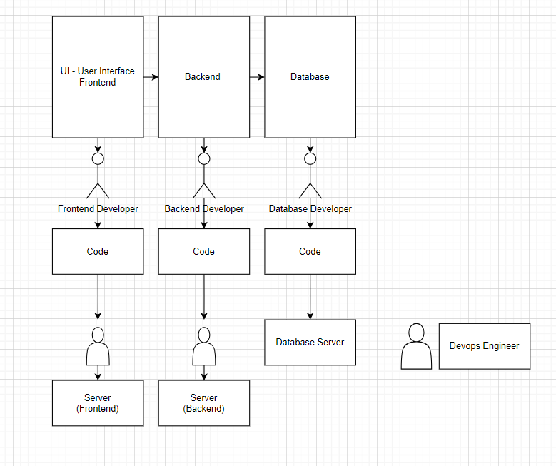

# Assignment 1: Three-Tier Diagram

## Objective:
Create a three-tier diagram representing the architecture discussed in class using [draw.io](https://app.diagrams.net/).

## Instructions:
1. Access [draw.io](https://app.diagrams.net/) and create a new diagram.
2. Design a three-tier architecture diagram based on the concepts discussed in class.
3. Clearly label each tier (presentation, application, and data layers) and include relevant components.
4. Save the diagram in an image format (PNG, JPEG, or any other common image format).

---

# Assignment 2: Linux Commands Practice

## Objective:
Practice essential Linux commands on the [JSLinux](https://bellard.org/jslinux/) platform, specifically using Fedora 33 in the Console.

## Instructions:
1. Access the [JSLinux](https://bellard.org/jslinux/) website and select the Fedora 33 (Linux) Console option.
2. Execute the following commands and carefully observe their output:
   - `whoami`: Display the current username.
   - `pwd`: Print the current working directory.
   - `cd`: Change the directory (try navigating to different directories).
   - `ls`: List the files and directories in the current location.
3. Make detailed notes regarding the purpose and output of each command.
4. Write a short summary explaining the functionality of each command and any observations or challenges faced during the practice.
5. Save your notes and submit them along with your summary during the next class.

---

Hi, I have forked the repo in my github account and then cloned the repo in my local system. Currently testing git push and have not done git init in my local due to running git clone command here. 

%% Hi, I am replying back from github gui direct edit option and confirming the updated message successfully pushed from local as present above. Need to learn how to create a validation here as well to accept or noty accept the change if anyone pushes to the code present here****

---
----------------------------------------------------------Solution-------------------------------------------------------------------------
Image of 3 tier architecture diagram:

whoami -> current username 
pwd -> printing current working directory
cd -> change directory
ls -> listing all the files and directories present under pwd

----------------------------------------------------------Solution Git------------------------------------------------------------------

Updating the solutions for git commands in an other file.

Git show will not give details like git status whether one partricular change is yet left to be added with git add command.It gives information on last particular commit or if commit hash id given then we will get detailed information about that particular pointing commit.

Git status gives details on current branch we are at present and different against the last commit in the branch.

Git init, git add #filename-complete address||.(for adding all the files), git commit -m "type messaage here"

Git branch lets us know our current branch and also other branches from the origin

Git checkout -b #newbranch creates a new branch with the given branch name and also checks us inside the craeted branch 

Git checkout #branch used to go to the given branch name 

git log, git show, git diff - dealing with git hash ids

git merge #branchtobeadded is used to merge the code to the current branch we are at present

git add
git commit -m ""
git push

git commit -m "Hide" --amend 

git push -f

In Git, there are three main stages that represent the lifecycle of your changes: the Working Directory, the Staging Area (also known as the Index), and the Repository (Committed). Here's an overview of each stage:

Working Directory:

The working directory is where you make modifications to your files. It contains the current state of your project. When you edit a file, these changes are initially only in the working directory and are not tracked by Git.
Staging Area (Index):

The staging area is an intermediate area where changes are prepared to be committed. After making modifications in the working directory, you use the git add command to stage specific changes for the next commit. This allows you to selectively include changes in the upcoming commit while leaving other modifications uncommitted.
Repository (Committed):

The committed stage represents the permanent storage of your changes in the Git repository. After staging changes using git add, you use the git commit command to create a new commit. A commit is a snapshot of the changes you've staged, along with a commit message that describes the changes. Commits are stored in the Git repository and create a version history for your project.
In summary:

Working Directory: Where you make changes to your files.
Staging Area (Index): Where changes are prepared to be committed.
Repository (Committed): Where changes are permanently stored in the Git history.
The use of these stages allows you to have more control over your version history, enabling you to review and selectively include changes in a structured manner.

git reset 
git reset --soft 
git reset --hard - changes the working directory changes (changes made before using git add)

**Note:** Ensure that you follow the instructions carefully, and if you encounter any difficulties, feel free to seek assistance during the next doubt class or through the designated communication channels.
